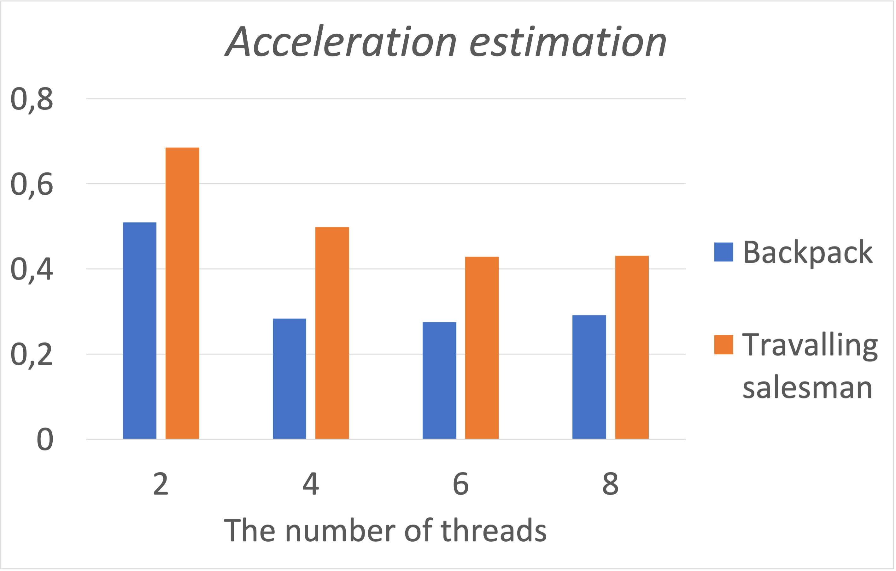

# Parallel Computing Practice 1

### Description 

Solving the traveling salesman problem and the backpack problem by brute force using std::threads.

### Build and run

To build and launch this project on macOS and Linux run next commands in terminal from project directory. 
The number of threads are hardcoded now, but you can change value of `N_THREADS` in src/backpack.cpp or in src/travelling_salesman.cpp before build. 

***Build:***
```bash
mkdir build
cd build
cmake -DCMAKE_BUILD_TYPE=Release ..
make install
cd ../bin
```

***Launch travelling salesman solver:***
```bash
./travelling_salesman 
```
***Launch backpack problem solver:***
```bash
./backpack
```

### Acceleration estimation 
The ratio of the execution time of a parallel implementation to the execution time of a sequential implementation showed on the picture below:



